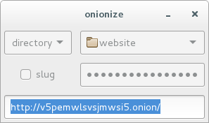

onionize
===========
Make an onion site (aka HTTP over onion services) up and running from a
directory, a file, zip archive contents or another HTTP server.

Onion services are end-to-end encrypted, metadata-free and forward-secure
(see [design overview](https://www.torproject.org/docs/hidden-services.html.en)).
Much love to onion services.

Install
-------
CLI-only version:
```
$ go get github.com/nogoegst/onionize
```
CLI + GUI version (reqiures GTK3 installed):
```
$ go get -tags gui github.com/nogoegst/onionize
```

Usage
-----
To onionize a thing pass the path to it:

```
$ onionize /path/to/thing
```

or the URL:

```
$ onionize https://example.com/
```
Pass `-zip` flag to serve from the zip archive.

Grab the onion link from `stdout` and errors/info from `stderr`.
 
That's it.

GUI mode
--------
To run `onionize` in GUI mode just don't specify any path.
Select target type, open your file/directory and click `onionize`:


Then you can grab the link from a text field:



You can find more screenshots in `docs`.

Identity passphrase
-------------------

You may also specify a passphrase from which onion service identity key
will be derived. Thus you can preserve same .onion address across setups.

Identity passphrase can be specified on `stdin` by setting `-p` flag in CLI
or in corresponding field in GUI.

TLS
---
Yeah, tee-el-es... Specifying paths to X.509 key and certificate:

```
./onionize -tls-cert server.crt -tls-key server.key /path/to/the-thing
```
produces `https` onion site. `*_WITH_CHACHA20_POLY1305` are the only
enabled cipher suites.
